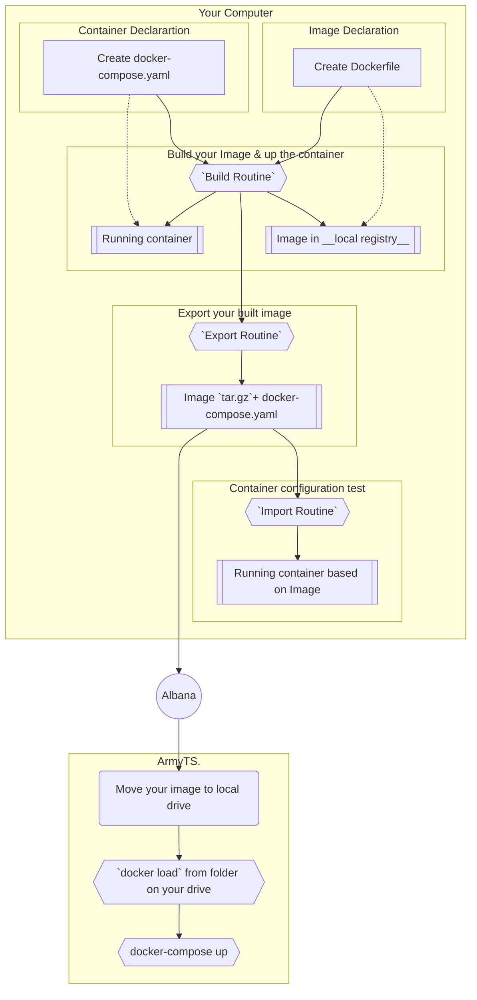

> To view this correctly please use markdown-syntax.
> See your editor package manager or check this https://stackedit.io/app#

# __Docker environment setup-er__

## General Explanation

Project was brought to organize uniform work environment in one particular manure.  

## Folder organization
- `Dev` : Directory with usefull script during new Image production
  - `buildContainerFrom.sh` : explained in next section
  - `exportImage.sh` : explained in next section
  - `importImage.sh` : explained in next section
- `Docker-Compose` : Directory containing your
`docker-compose.yaml`
  - `docker-compose-jupyter.yaml` : yaml file for reference
- `Dockerfiles` : Directory containing your `Dockerfiles`
  - `Dockerfile[Python3.8].sh` : Dockerfile for reference
- `Entrypoint` : put here you startup script
  - `entrypoint.sh` : scipt for refernece
- `Images` : Directory containing ready to albana Image and compose
  - `Jupyter` : directory of a Image
    - `Jupyter.tar.gz` : image itself
    - `docker-compose.yaml` : compose to run Container __after load__
- `Include` : subdirectories to be copied to Image
  - `Data-Science-Inst` : will not be copied to Jupyter Image
  - `Basic-Jup-Inst` : will be copied to Jupyter Image
    - `requirements.txt` : python configuration file
    - `Basic Installation DepTree.txt` : file with image discription.

# Introduction to develompent

First, refresh this one https://www.baeldung.com/ops/docker-images-vs-containers.

In order build image with this project you have to supply 3 files to `buildContainerFrom.sh` script. Them are `Dockerfile`, `docker-compose.yaml` and `entrypoint.sh`.

#### Dockerfile :
        Declaration of Docker Image. A Docker image is a file
        that contains all the files and apps necessary
        to run an application.

        When building Docker Image from Dockerfile must ensure
        architecture compatibility. Therefore the owner of AMD-based
        chipsets must go check AMD versions from Dockerfiles directory.
        All the others with Intel/x86-based chipsets could use
        regular Dockerfile.

 ```mermaid
 graph LR
  subgraph Source
  A
  end
  subgraph Target
  B
  end
  A[Dockerfile] --> C{{docker build}} --> B[Docker Image]
  A -->E{{docker-compose build}}--> B
 ```
 > In this particular case `docker build` and `docker-compose build` are same.

  &nbsp;  Please see https://docs.docker.com/engine/reference/builder/; https://hub.docker.com/search

  &nbsp;  Check out existing `Dockerfile`s inside `./Dockerfiles/` directory

#### Entrypoint.sh
       Inside Dockerfile we should also copy `entrypoint.sh`
       as startup script. i.e. every time container is dispatched,
       it will start running from entrypoint.sh Bash script.

```bash
#!bin/bash

echo 'Example of entrypoint: run Jupyter on start'

jupyter notebook --allow-root --no-browser --ip=0.0.0.0 --port=8880
```

Please see https://stackoverflow.com/questions/47671589/how-can-i-run-script-automatically-after-docker-container-startup

#### docker-compose.yaml :
         Configuration File. Declaration of Docker Container.
         A Docker container is a Docker image that has been started.

         All the `docker run` flags and parameters could also be declared
         inside of `docker-compose.yaml`.
         Used to define behavior of Container. Useful for automating
         port mappings, setting container names, and auto-mounting.

 ```mermaid
 graph LR
 subgraph Source
	 A[Docker Image] & B[docker-compose.yaml]
 end

  subgraph Target
  C
  end
  A & B --> E{{docker-compose up . }} --> C[Docker Container]
 ```

  > To use `docker-compose.yaml` should run `docker-compose up` to run the Container/Application

&nbsp;   Please see https://www.educative.io/blog/docker-compose-tutorial

&nbsp;   Check out existing `docker-compose.yaml` inside `./Docker-Compose/` directory

# __How to use__

### Installations: 
Before we start, we would recommend following stack: 

1.  [Docker Desktop](https://www.docker.com/products/docker-desktop/)
2.  Your favorite Terminal
3.  Code Editor: [VS Code](https://code.visualstudio.com/)
    1. Extention: [Bash Syntax](https://marketplace.visualstudio.com/items?itemName=jeff-hykin.better-shellscript-syntax)
    2. Extention: [Dockerfile Syntax](https://marketplace.visualstudio.com/items?itemName=jeff-hykin.better-dockerfile-syntax)
    3. Optional Extention: [Docker Extension for VSCode](https://marketplace.visualstudio.com/items?itemName=ms-azuretools.vscode-docker)




## Build Routine:

>  `bash buildContainerFrom.sh '<Your Dockerfile>' '<Your docker-compose.yaml>'`

> Your Dockerfile must be placed inside `Dockerfiles/` dir; there is also `DOCKERFILE_DIR` variable defined in script.
>So your `docker-compose.yaml` must be placed inside `Docker-Compose/` dir; there is also `DOCKER_COMPOSE_DIR` variable defined in script
>
> Your `Dockerfile` and `docker-compose.yaml` files will be brought to home directory and used for build of Image. Script will auto execute the application, i.e up the container with your Image.

```bash
echo "Example of usage"

echo "Pass path to my Dockerfile and docker-compose.yaml"
bash Dev/buildContainerFrom.sh 'AMD/Dockerfile[Py3.8.13-Jupyter-AMD].sh' 'docker-compose-jupyter.yaml'
```

## Export Image

> `bash exportImage.sh '<Target Name>'`

> Script creates ready-to-go directory inside `Images/` directory containing tar-ball with image itself and `docker-compose.yaml` to be run after albana.

```bash
echo "Example of usage"

echo "Pass Name for your target directory"
bash Dev/exportImage.sh 'Jupyter'
```

> __Warining__: run this scripts only after you build your `Dockerfile`! Script auto export Image that is set inside `docker-compose.yaml` in home directory. Thus it may export not correct image if `buildContainerFrom.sh` did not run before.

Please see https://dockerlabs.collabnix.com/beginners/saving-images-as-tar/

## Import Image

This script was created to test if exported Container runs and executes correctly.

 > `bash importImage.sh '<Source Name>'`

> Just `docker load` and `docker-compose up` from them project-based  `docker-compose.yaml`

```bash
echo "Example of usage"

echo "Pass Image name to build and up-load"
bash Dev/importImage.sh 'Jupyter'
```
> __Warining__: run this scripts only after you build your `Dockerfile`! Script auto export Image that is set inside `docker-compose.yaml` in home directory. Thus it may export not correct image if `buildContainerFrom.sh` or `exportImage.sh` did not run before.
